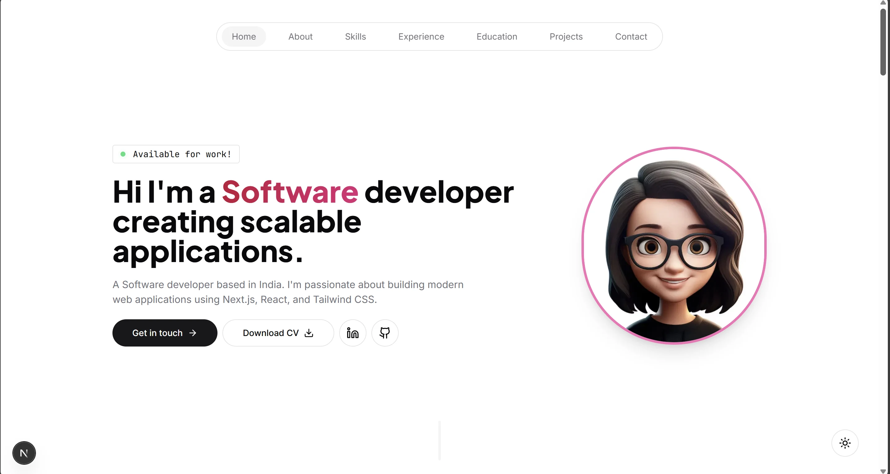

# 💼 Gousiga's Developer Portfolio

My personal portfolio website built using **Next.js**, **Tailwind CSS**, and **Framer Motion**, designed to showcase my development skills, projects, experience, and achievements in an elegant and responsive interface.

🔗 **Live Site:** [https://gousigavs.vercel.app](https://gousigavs.vercel.app)

---

## ✨ Features

- Responsive and modern design
- Animated UI with Framer Motion
- Contact form powered by Resend
- Smooth scroll navigation
- Organized sections: About, Skills, Experience, Projects, Certifications, Contact
- Easy content updates using `lib/` data files

---

## 🔧 Tech Stack

- [Next.js](https://nextjs.org/)
- [TypeScript](https://www.typescriptlang.org/)
- [Tailwind CSS](https://tailwindcss.com/)
- [Framer Motion](https://www.framer.com/motion/)
- [React Hook Form](https://react-hook-form.com/)
- [Resend](https://resend.com/) (email service for contact form)

## 📬 Contact

If you encounter any issues or have questions, feel free to reach out:  
📧 **gousigavs@gmail.com**

---

## 📄 License

This project is open-source and available under the **MIT License**.

---

Made with 💻, ☕, and a lot of ❤️ by **Gousiga V S**  
Thank you for visiting my portfolio!
